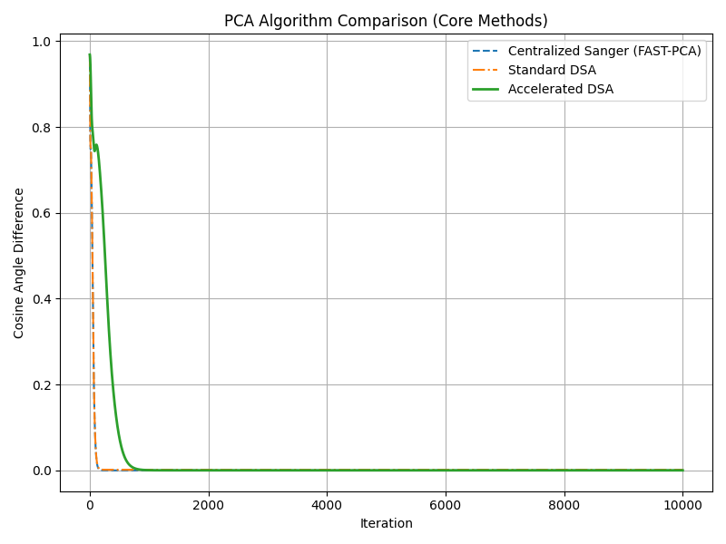
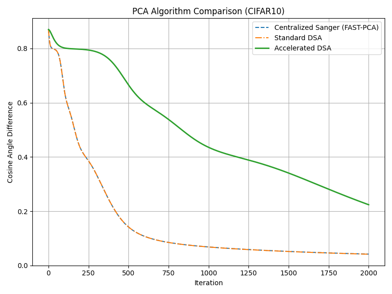
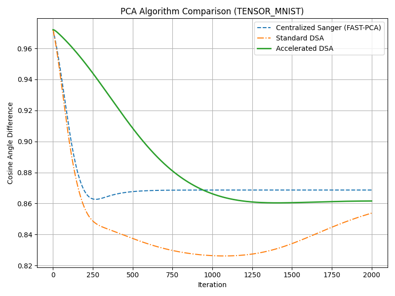
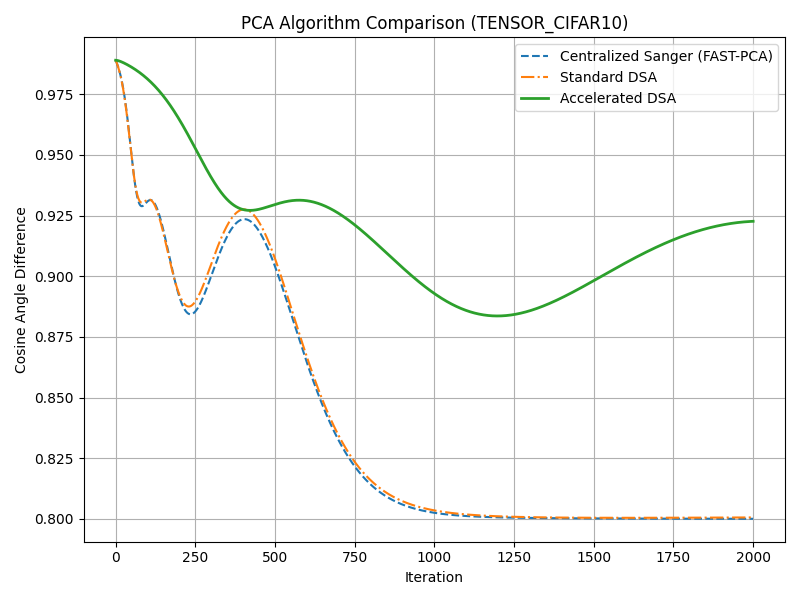

# 📊 Distributed PCA with Tensor Decomposition and Accelerated Learning

This project implements and compares several PCA algorithms for distributed machine learning, including:
- Centralized Sanger (FAST-PCA)
- Standard Distributed Subspace Approximation (DSA)
- Accelerated DSA (with momentum)
- Tensor-based PCA using Tucker Decomposition

> ✅ Designed for AI/ML research on dimensionality reduction, communication-efficient learning, and subspace optimization in distributed environments.

---

## 🚀 Key ML Contributions

- **Distributed PCA**: Enables scalable, decentralized subspace learning across nodes.
- **Accelerated DSA**: Momentum-based optimization significantly speeds up convergence.
- **Tensor PCA (Tucker)**: Applies decomposition on multi-dimensional data to reduce memory usage and improve convergence on real-world image datasets.
- **Cosine Angle Distance**: Used as the evaluation metric to measure distance from ground truth eigenspace.

---

## 📂 Datasets Used

- 🖼️ [MNIST](http://yann.lecun.com/exdb/mnist/) (handwritten digits)
- 🌈 [CIFAR-10](https://www.cs.toronto.edu/~kriz/cifar.html) (natural RGB images)

You can use the `--limit` flag for memory-constrained experiments.

---

## 📊 Experimental Results

### 🧪 Raw Dataset Experiments (MNIST & CIFAR-10)




✅ **Findings:**
- Centralized Sanger (FAST-PCA) is fast but not scalable across nodes.
- Standard DSA suffers from slow convergence due to full-dimensional communication.
- Accelerated DSA shows better convergence with a notable accuracy boost, especially on MNIST.
- However, raw datasets still incur **high memory costs**, making them suboptimal for large-scale distributed learning.

---

### 🔺 Tensor-Based Experiments (Tucker MNIST & CIFAR-10)




✅ **Findings:**
- Applying Tucker decomposition **drastically reduces dimensionality**, compressing input data before running PCA.
- This leads to **faster convergence and lower error** for both Standard and Accelerated DSA.
- Accelerated DSA benefits most, consistently reaching high accuracy early.
- Especially on CIFAR-10, the tensor-based approach **outperforms raw input** across all models.

---

## 🧠 Why It Matters for ML

- **Efficient Subspace Learning**: Useful for training models on high-dimensional sensor/image data in federated or IoT systems.
- **Reduced Memory & Communication**: Tucker decomposition removes redundancy before training, reducing GPU/CPU load.
- **ML Scalability**: Demonstrates how modern PCA variants can operate efficiently across edge and distributed systems.

---

## 🧪 How to Run

```bash
# Raw MNIST
python comparison_run.py -ds mnist -i 2000 --limit 3000

# Raw CIFAR-10
python comparison_run.py -ds cifar10 -i 2000 --limit 3000

# Tensor MNIST
python comparison_run.py -ds tensor_mnist -i 2000 -r 10 --limit 3000

# Tensor CIFAR-10
python comparison_run.py -ds tensor_cifar10 -i 2000 -r 10 --limit 3000
