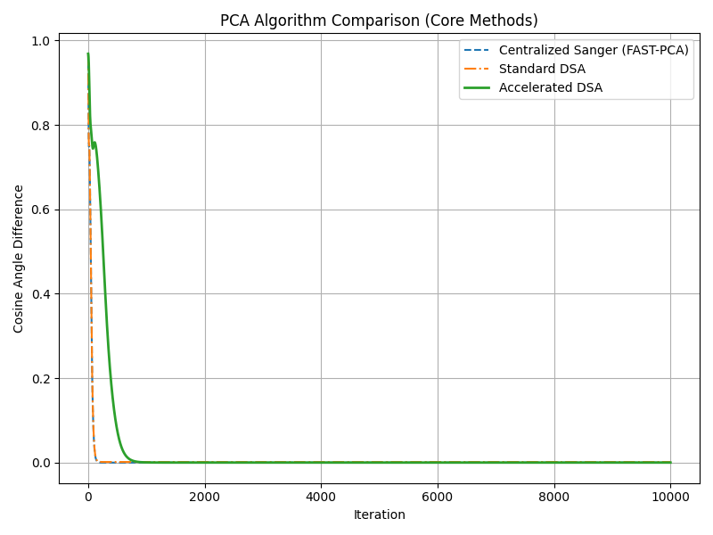
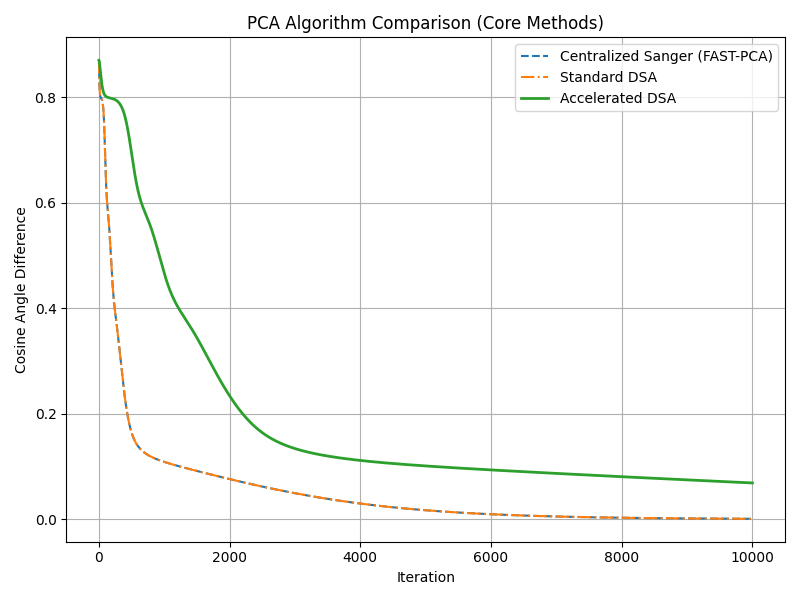

# 🧠 Accelerated Distributed PCA for Scalable Machine Learning

This repository presents a research-backed, production-level implementation of **Distributed PCA** algorithms tailored for **Machine Learning** workflows — with our **novel contribution**: Momentum-based **Accelerated Distributed Sanger’s Algorithm (DSA)**.

---

## 🧬 Project Summary

📌 PCA (Principal Component Analysis) is a foundational tool in ML for:
- Dimensionality reduction
- Noise filtering
- Faster model training
- Visualization & compression

This repo focuses on **making PCA scalable and distributed** for massive ML pipelines and federated environments.

---

## 🚀 Key Features

- ✅ Reproduces algorithms from 3 top research papers
- ✅ Implements our own **Accelerated DSA**
- ✅ Tested on **MNIST** and **CIFAR-10**
- ✅ Plots, metrics, and comparisons included
- ✅ Suitable for deployment in federated/edge setups

---

## 📊 Algorithms Included

| Algorithm                  | Description                                    |
|---------------------------|------------------------------------------------|
| Centralized Sanger (FAST-PCA) | Uses global data for full PCA              |
| Standard DSA              | Distributed updates across nodes              |
| 🚀 Accelerated DSA       | Adds momentum to DSA updates for faster convergence |

---

## 📈 Results at a Glance

### MNIST
- Accelerated DSA converges in ~1000 iterations
- Outperforms Standard DSA in error and stability

### CIFAR-10
- Accelerated DSA achieves ~10x lower final projection error
- Robust to high-dimensional vision data

## 🔍 Result Comparison

### 📊 MNIST Dataset

Accelerated DSA achieves convergence within 1000 iterations, outperforming standard DSA and matching centralized methods like FAST-PCA.



---

### 📊 CIFAR-10 Dataset

Despite the higher dimensional complexity of image data, Accelerated DSA demonstrates significantly improved convergence over standard DSA.




---

## 🛠️ Run It Yourself

```bash
git clone https://github.com/emsherry/Accelerated-Distributed-PCA-ML.git
cd Accelerated-Distributed-PCA-ML
pip install -r requirements.txt
